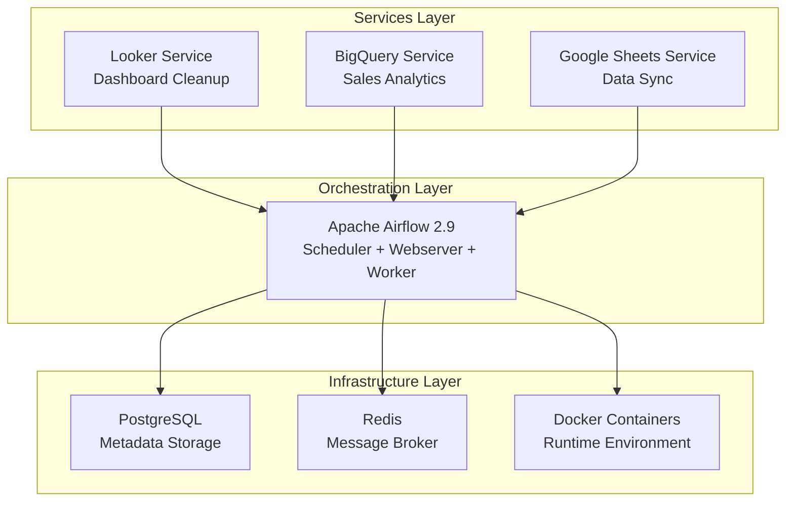
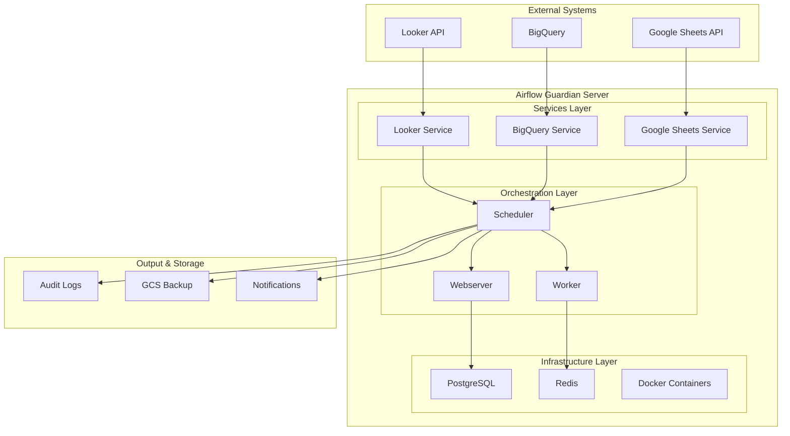

# Documentation Index

## Overview

This directory contains comprehensive documentation for the Gill Capital Airflow Guardian Server, covering architecture, operations, deployment, and maintenance procedures.

## Documentation Structure

```
docs/
├── README.md                    # This index file
├── architecture/               # System architecture documentation
│   ├── system-architecture.md  # High-level system architecture
│   ├── dag-dependencies.md     # DAG scheduling and dependencies
│   └── data-flow.md            # Data flow diagrams and processes
├── dataops/                   # DataOps practices and procedures
│   ├── README.md              # DataOps principles and guidelines
│   └── operational-runbook.md  # Day-to-day operations guide
└── deployment/                # Deployment and infrastructure
    └── infrastructure-guide.md # Infrastructure and deployment guide
```

## Quick Navigation

### 🏗️ Architecture Documentation
- **[System Architecture](architecture/system-architecture.md)** - High-level system design and component relationships
- **[DAG Dependencies](architecture/dag-dependencies.md)** - DAG scheduling, dependencies, and execution flow
- **[Data Flow](architecture/data-flow.md)** - Data processing pipelines and service interactions

### 🔧 DataOps Documentation
- **[DataOps Principles](dataops/README.md)** - DataOps methodology, best practices, and team collaboration
- **[Operational Runbook](dataops/operational-runbook.md)** - Daily operations, troubleshooting, and maintenance procedures

### 🚀 Deployment Documentation
- **[Infrastructure Guide](deployment/infrastructure-guide.md)** - Deployment strategies, monitoring, and infrastructure management
- **[GCP Deployment Guide](deployment/gcp-deployment-guide.md)** - Google Cloud Platform Compute Engine deployment with Secret Manager

## Service Overview

### Current Services

| Service | Purpose | Schedule | DAG ID | Status |
|---------|---------|----------|--------|--------|
| **Looker** | Dashboard lifecycle management and cleanup | Monthly (1st at 00:00) | `looker_dashboard_deletion` | ✅ Active |
| **BigQuery** | Sales data queries and analytics | Manual trigger | `bigquery_sales_query` | ✅ Active |
| **Google Sheets** | Trigger-based data synchronization | Every 5 minutes | `google_sheet_trigger_dag` | ✅ Active |

### Service Architecture



## Key Features

### 🔄 **Automated Orchestration**
- Apache Airflow 2.9 with CeleryExecutor
- Docker-based deployment
- Comprehensive monitoring and alerting

### 🛡️ **Data Quality & Security**
- Data validation at every stage
- Secure credential management
- Audit logging and compliance

### 📊 **Monitoring & Observability**
- Real-time performance monitoring
- Comprehensive logging
- Automated alerting and notifications

### 🔧 **Operational Excellence**
- Automated testing and validation
- Blue-green deployment strategies
- Disaster recovery procedures

## Getting Started

### For Developers
1. Read [DataOps Principles](dataops/README.md) to understand our methodology
2. Review [System Architecture](architecture/system-architecture.md) for technical overview
3. Follow [Operational Runbook](dataops/operational-runbook.md) for daily operations

### For DevOps Engineers
1. Start with [Infrastructure Guide](deployment/infrastructure-guide.md)
2. Review [Deployment Strategies](deployment/infrastructure-guide.md#deployment-strategies)
3. Follow [Security Architecture](deployment/infrastructure-guide.md#security-architecture)

### For Data Engineers
1. Understand [Data Flow Architecture](architecture/data-flow.md)
2. Review [DAG Dependencies](architecture/dag-dependencies.md)
3. Follow [Data Quality Pipeline](architecture/data-flow.md#data-quality-pipeline)

## Architecture Diagrams

### System Overview


## Best Practices

### 📋 **Development**
- Follow PEP 8 Python style guide
- Use type hints for better code clarity
- Implement comprehensive error handling
- Write unit tests for all functions

### 🔄 **Data Pipeline Design**
- Design for failure and recovery
- Implement idempotent operations
- Use appropriate data formats and compression
- Plan for data volume growth

### 📊 **Monitoring & Alerting**
- Set up proactive monitoring
- Define clear alert thresholds
- Implement escalation procedures
- Regular review of alert effectiveness

## Quick Commands

### Essential Operations
```bash
# Start services
./start_airflow.sh

# Check status
docker compose ps

# View logs
docker compose logs -f

# Stop services
docker compose down

# Access Airflow UI
open http://localhost:8080
```

### Monitoring Commands
```bash
# Check DAG status
curl -u airflow:airflow http://localhost:8080/api/v1/dags

# Check system health
curl -u airflow:airflow http://localhost:8080/health

# View resource usage
docker stats --no-stream
```

## Support & Maintenance

### 📞 **Emergency Contacts**
- **On-Call Engineer**: [Contact Information]
- **Data Engineering Lead**: [Email]
- **DevOps Team**: [Slack Channel]

### 🔗 **Useful Links**
- **Airflow UI**: http://localhost:8080
- **GitHub Repository**: https://github.com/GillCapital/gc-airflow-guardian-server
- **Monitoring Dashboard**: [URL]
- **Documentation**: ./docs/

### 📅 **Maintenance Schedule**
- **Daily**: Monitor DAG executions and alerts
- **Weekly**: Review performance metrics and logs
- **Monthly**: Update dependencies and security patches
- **Quarterly**: Architecture review and optimization

## Contributing

### 📝 **Documentation Updates**
1. Update relevant documentation files
2. Ensure diagrams are current
3. Test all procedures
4. Submit pull request with clear description

### 🔧 **Code Changes**
1. Follow established patterns
2. Update documentation as needed
3. Add appropriate tests
4. Review with team before merging

---

## Version History

| Version | Date | Changes |
|---------|------|---------|
| 1.0 | September 2024 | Initial documentation release |

---

*This documentation is maintained by the Data Engineering team. For questions or updates, please contact the team or submit a pull request.*
