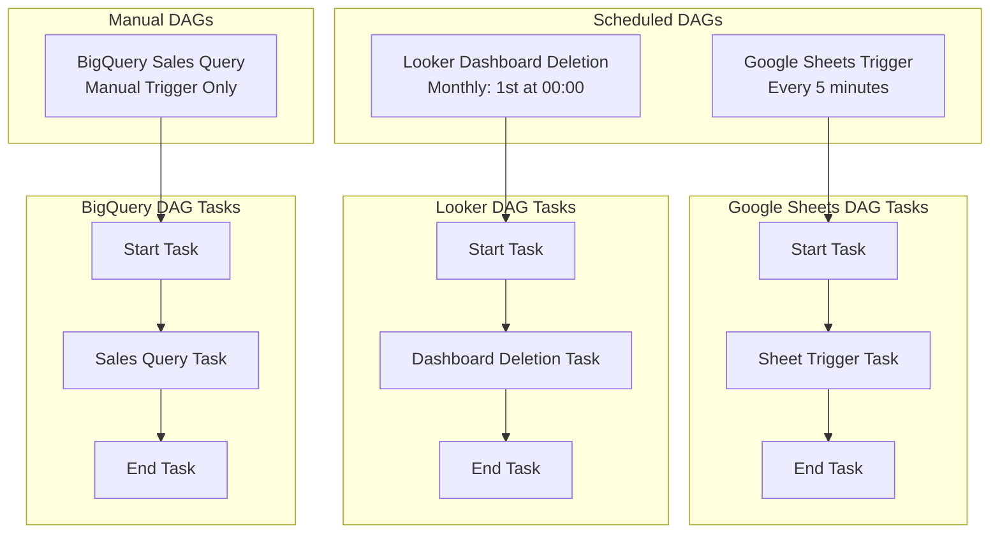
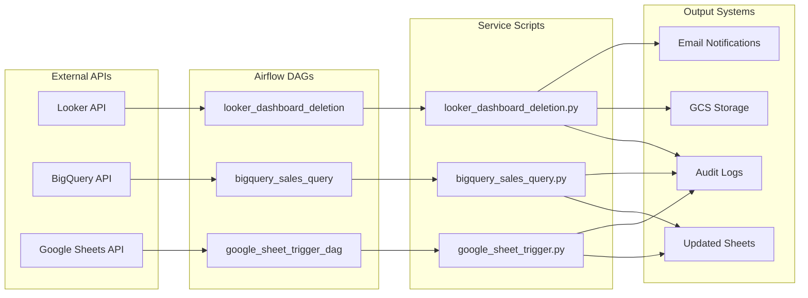
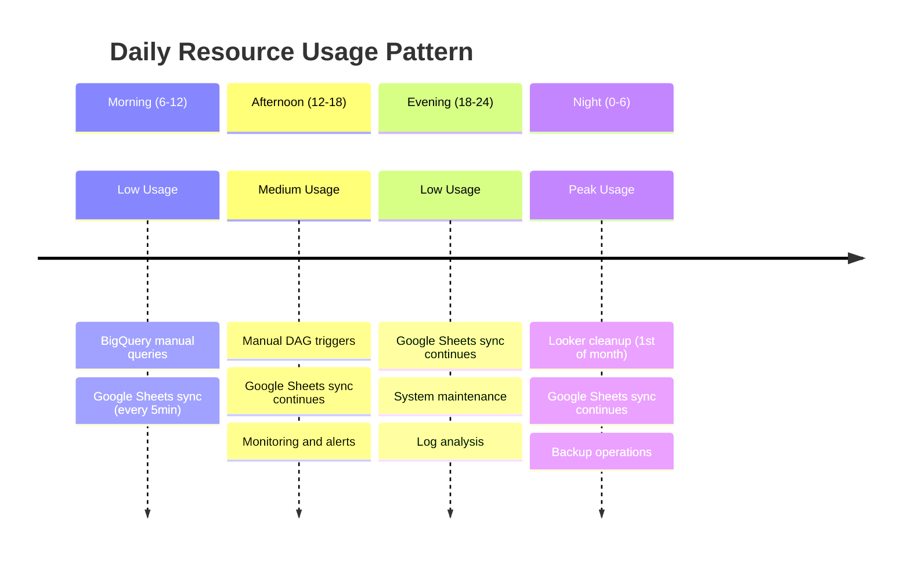
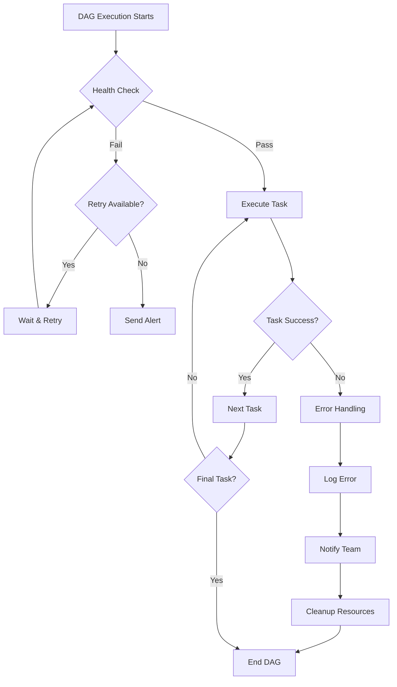
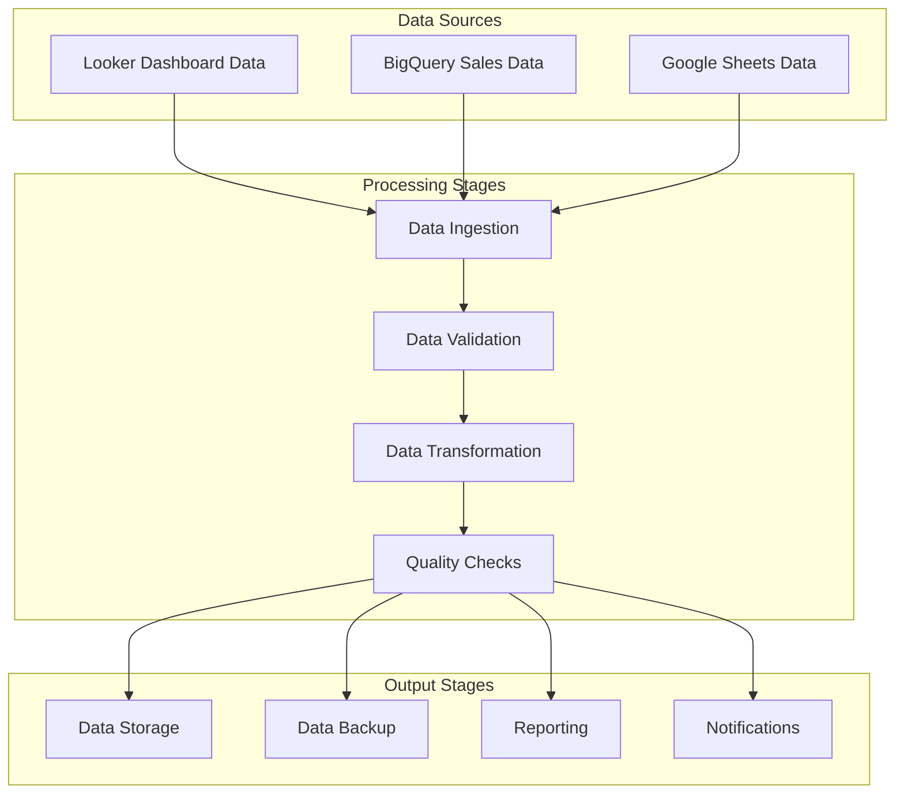
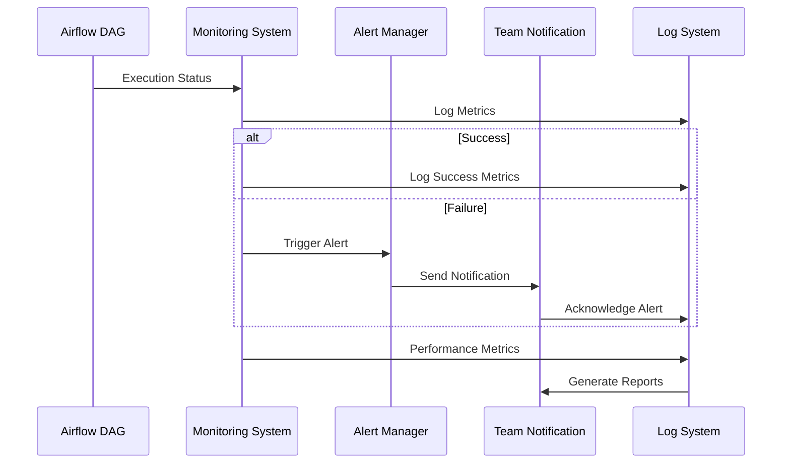
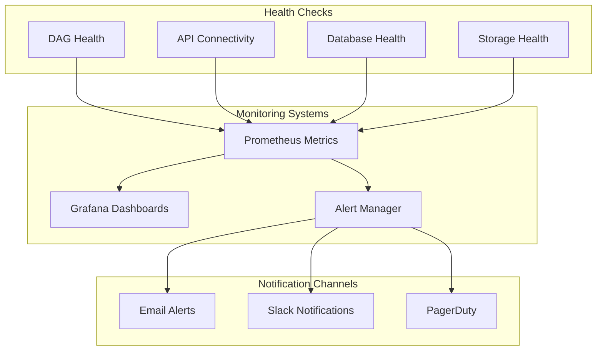

# DAG Dependencies & Scheduling

## DAG Overview

```mermaid
gantt
    title Airflow DAG Schedule Overview
    dateFormat  YYYY-MM-DD
    section Looker Service
    Dashboard Deletion    :done, looker, 2024-01-01, 2024-12-31
    section BigQuery Service
    Sales Query          :manual, bq, 2024-01-01, 2024-12-31
    section Google Sheets Service
    Sheet Trigger        :active, gs, 2024-01-01, 2024-12-31
```

## DAG Execution Flow



## Service Integration Points



## Resource Utilization Timeline



## Error Handling & Recovery



## Data Pipeline Dependencies



## Monitoring & Alerting Flow



## Service Health Monitoring


