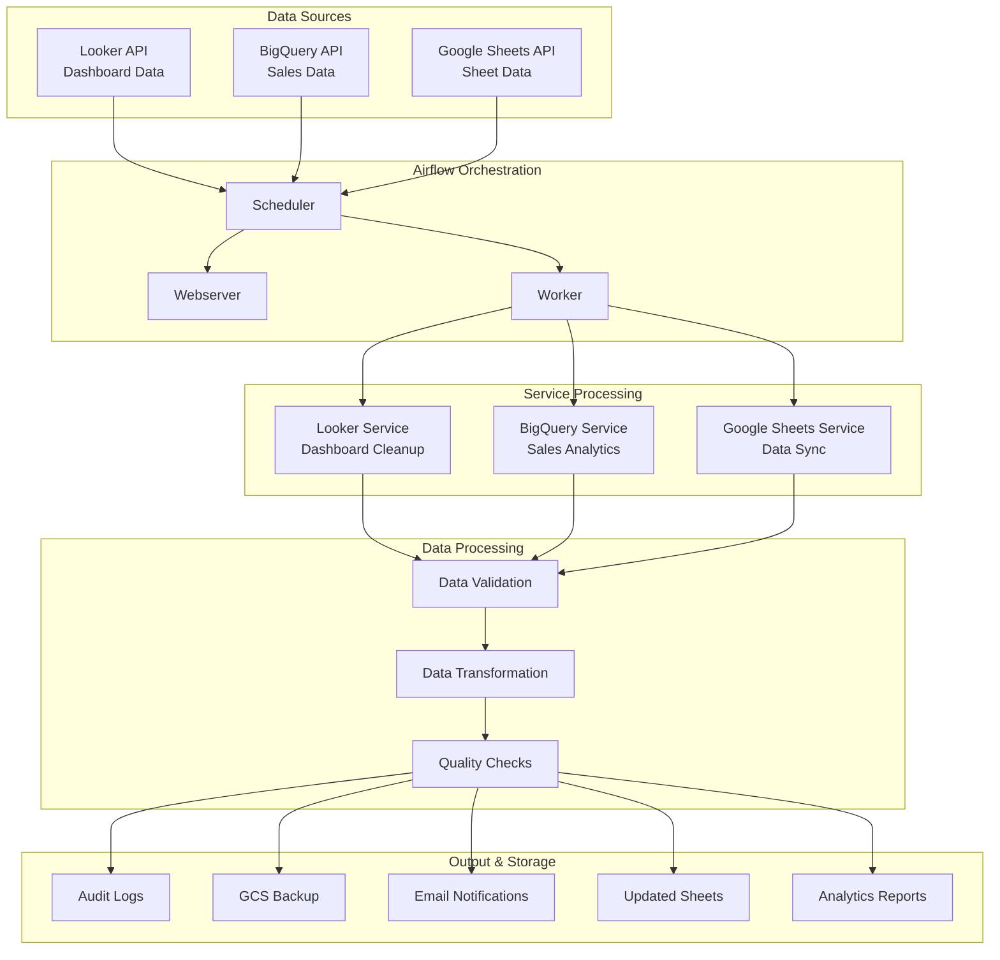
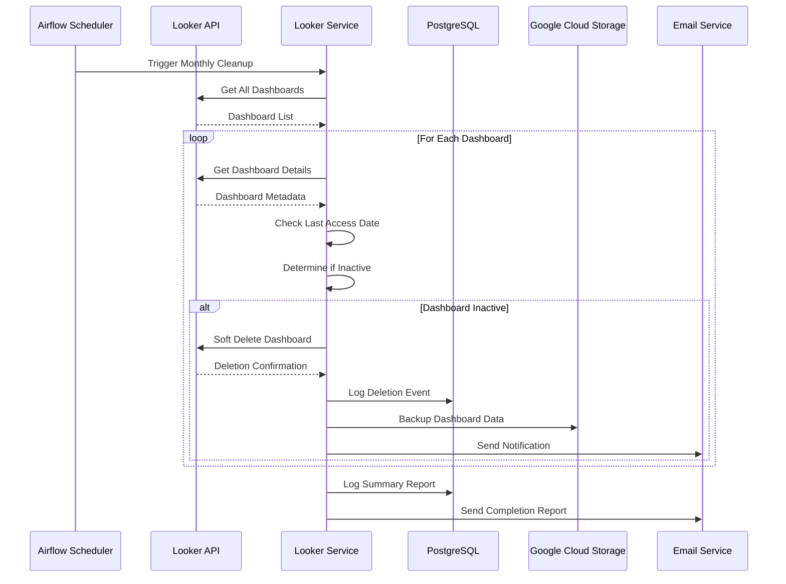
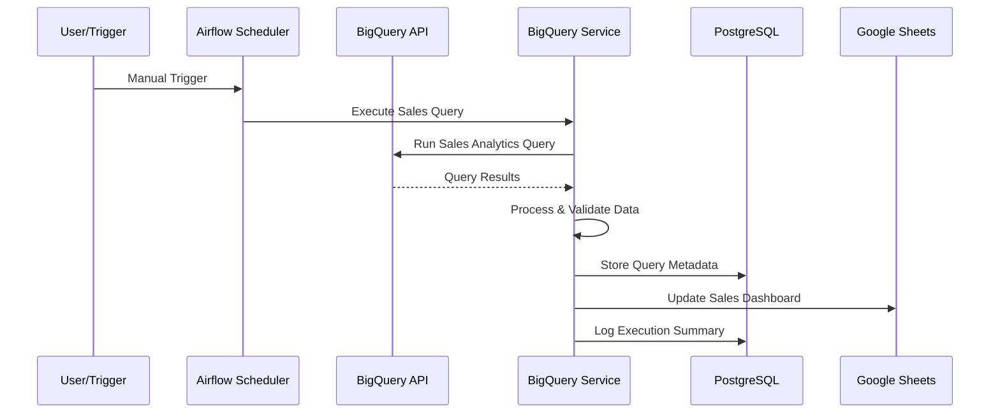
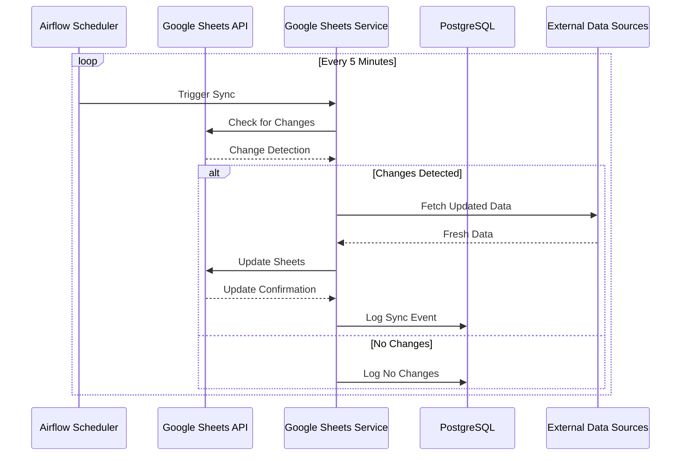
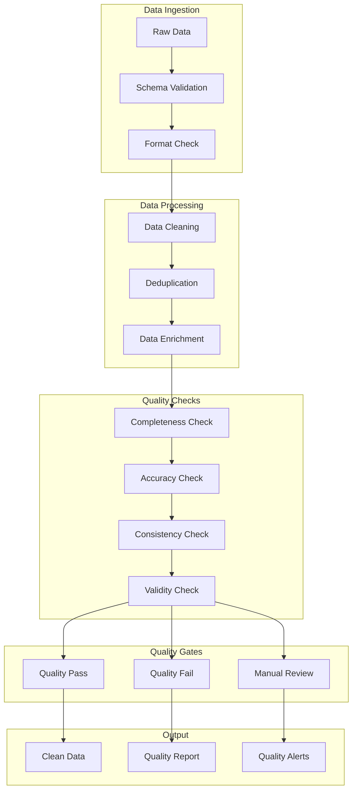
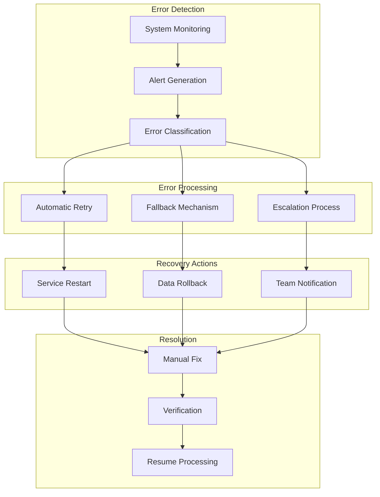
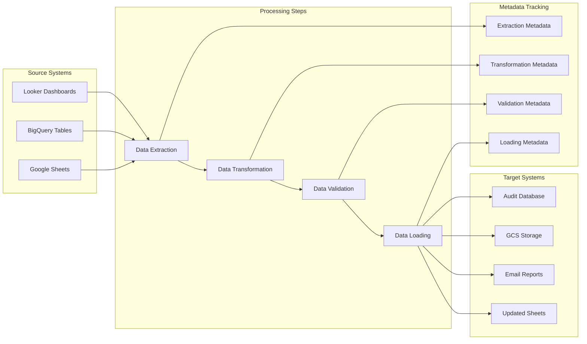
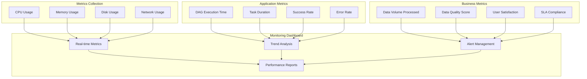
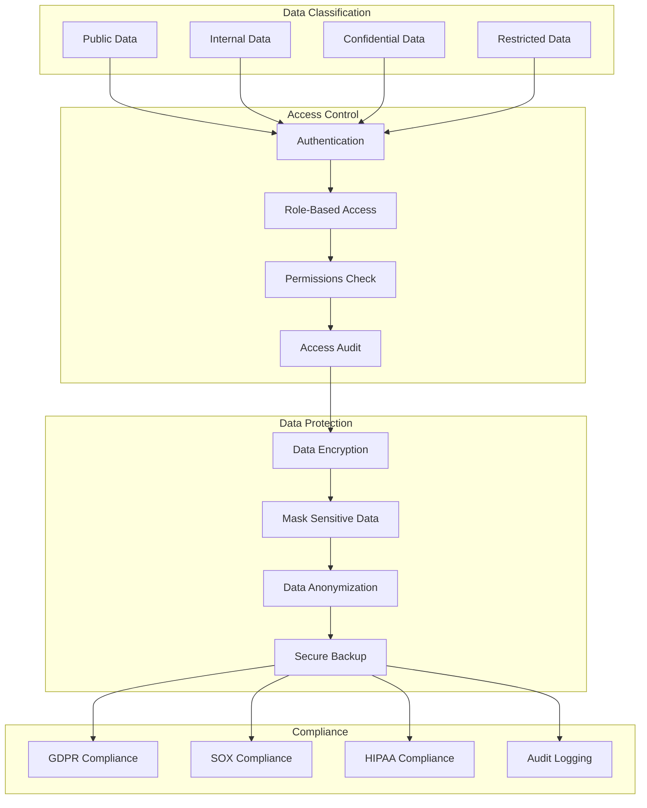

# Data Flow Architecture

## Overall Data Flow

## Looker Service Data Flow

## BigQuery Service Data Flow

## Google Sheets Service Data Flow

## Data Quality Pipeline

## Error Handling & Recovery Flow

## Data Lineage Tracking

## Performance Monitoring Flow

## Data Security Flow

