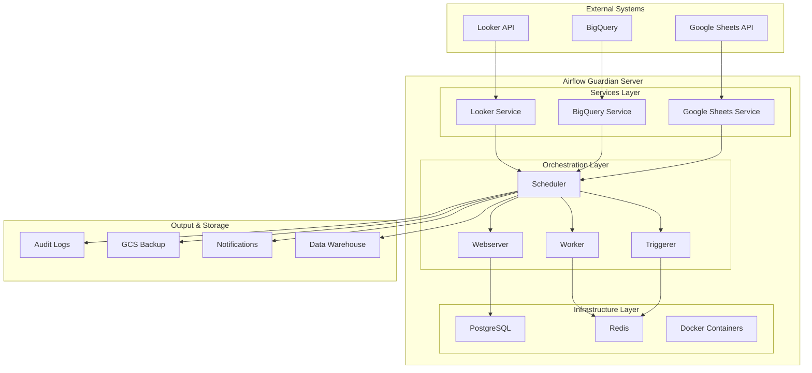
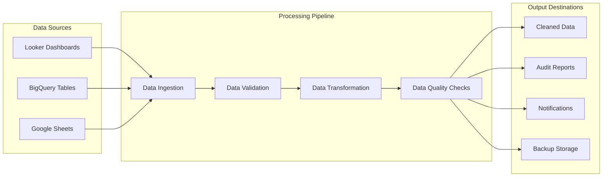
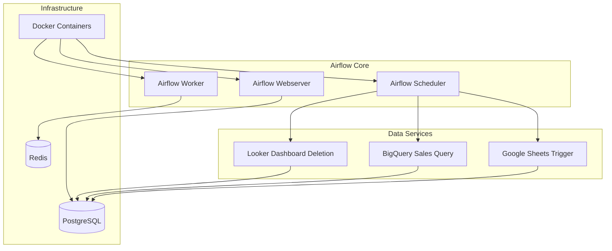
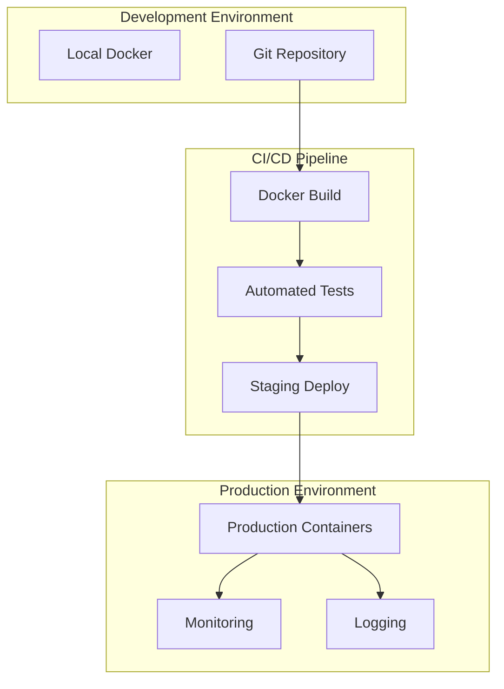
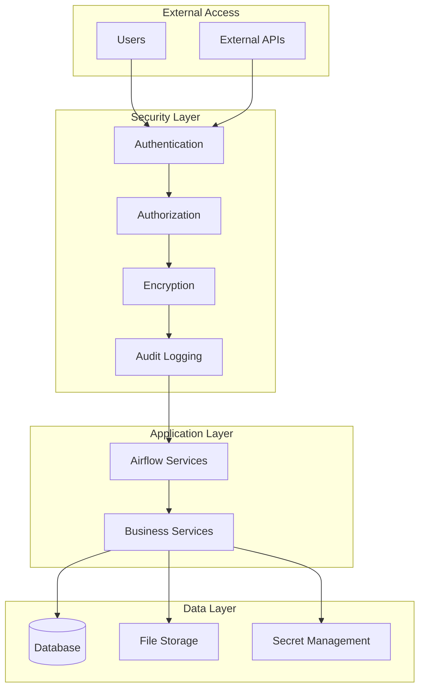
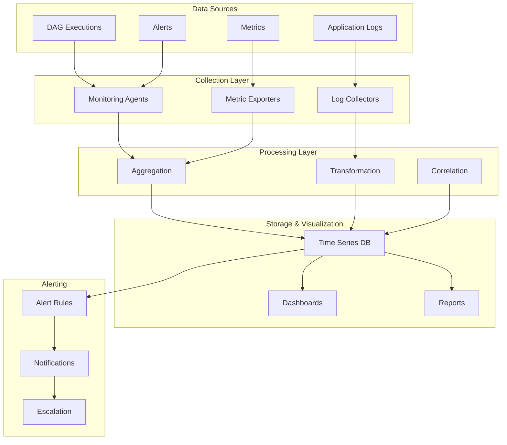

# System Architecture Diagram

## High-Level Architecture

## Data Flow Architecture

## Service Dependencies

## Deployment Architecture

## Security Architecture

## Monitoring & Observability

