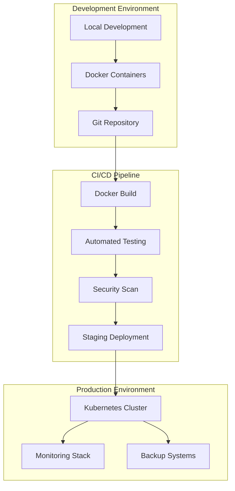
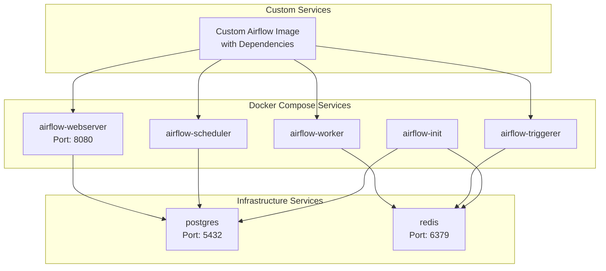
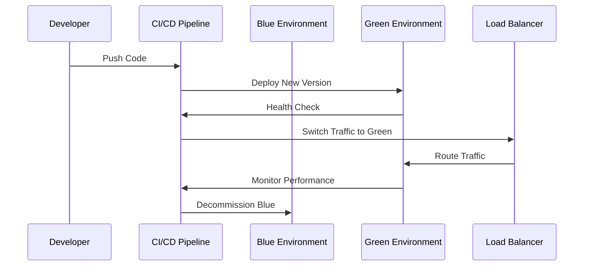
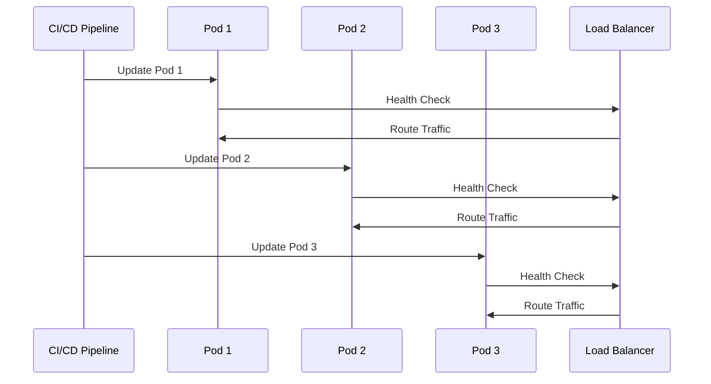
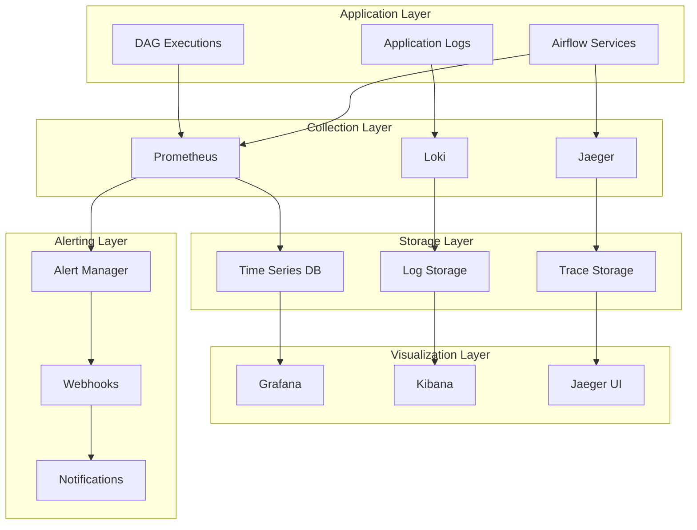
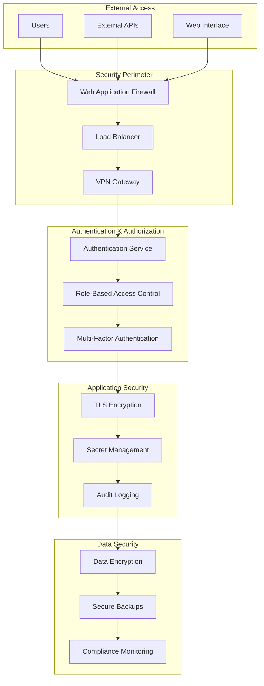
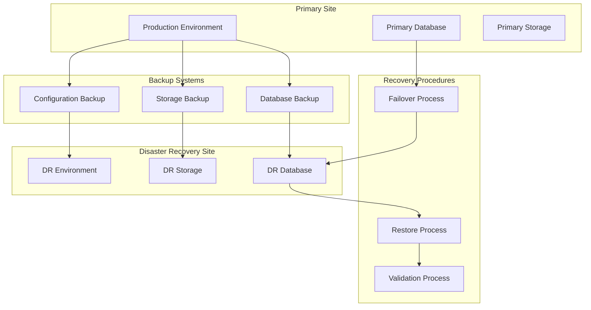
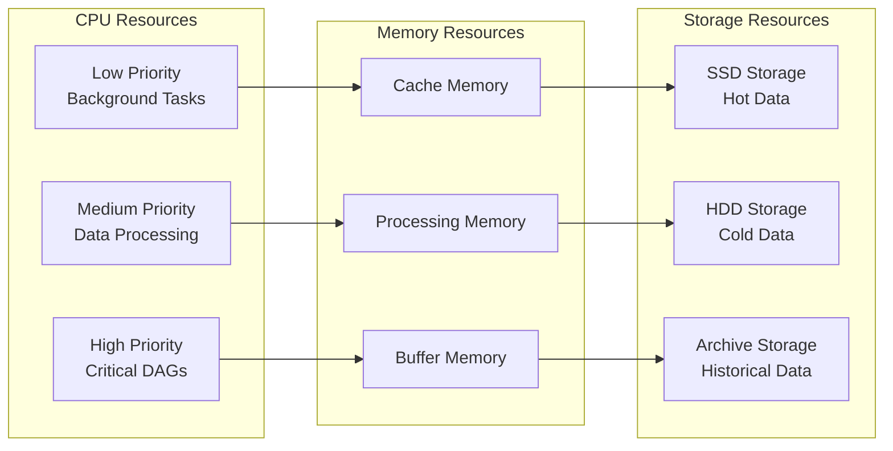
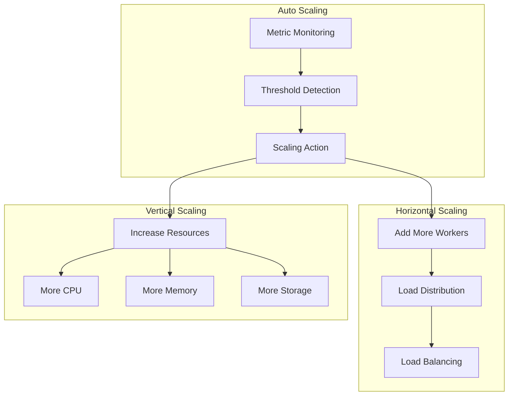

# Deployment & Infrastructure Guide

## Infrastructure Overview



## Docker Architecture



## Environment Configuration

### Development Environment

```yaml
# docker-compose.dev.yml
version: '3.8'
services:
  airflow-webserver:
    ports:
      - "8080:8080"
    environment:
      AIRFLOW__CORE__DAGS_ARE_PAUSED_AT_CREATION: 'false'
      AIRFLOW__CORE__LOAD_EXAMPLES: 'true'
  
  postgres:
    environment:
      POSTGRES_DB: airflow_dev
```

### Staging Environment

```yaml
# docker-compose.staging.yml
version: '3.8'
services:
  airflow-webserver:
    ports:
      - "8080:8080"
    environment:
      AIRFLOW__CORE__DAGS_ARE_PAUSED_AT_CREATION: 'true'
      AIRFLOW__CORE__LOAD_EXAMPLES: 'false'
  
  postgres:
    environment:
      POSTGRES_DB: airflow_staging
```

### Production Environment

```yaml
# docker-compose.prod.yml
version: '3.8'
services:
  airflow-webserver:
    ports:
      - "8080:8080"
    environment:
      AIRFLOW__CORE__DAGS_ARE_PAUSED_AT_CREATION: 'true'
      AIRFLOW__CORE__LOAD_EXAMPLES: 'false'
      AIRFLOW__CORE__SECURITY__SECRET_KEY: ${AIRFLOW_SECRET_KEY}
  
  postgres:
    environment:
      POSTGRES_DB: airflow_prod
    volumes:
      - postgres_data:/var/lib/postgresql/data
```

## Deployment Strategies

### Blue-Green Deployment



### Rolling Deployment



## Monitoring & Observability Stack



## Security Architecture



## Backup & Disaster Recovery



## Performance Optimization

### Resource Allocation



### Scaling Strategy



## Deployment Checklist

### Pre-Deployment

- [ ] Code review completed
- [ ] Tests passing
- [ ] Security scan passed
- [ ] Documentation updated
- [ ] Environment variables configured
- [ ] Backup strategy verified

### Deployment

- [ ] Staging deployment successful
- [ ] Smoke tests passed
- [ ] Performance tests passed
- [ ] Production deployment initiated
- [ ] Health checks passed
- [ ] Monitoring configured

### Post-Deployment

- [ ] Production verification completed
- [ ] Team notified
- [ ] Documentation updated
- [ ] Monitoring alerts configured
- [ ] Rollback plan ready
- [ ] Performance baseline established

## Troubleshooting Guide

### Common Deployment Issues

1. **Container Startup Failures**
   - Check resource availability
   - Verify environment variables
   - Review container logs

2. **Database Connection Issues**
   - Verify database credentials
   - Check network connectivity
   - Review database logs

3. **DAG Loading Problems**
   - Check Python dependencies
   - Verify DAG syntax
   - Review Airflow logs

4. **Performance Issues**
   - Monitor resource utilization
   - Check for memory leaks
   - Review query performance

### Recovery Procedures

1. **Service Recovery**
   - Restart failed services
   - Check health endpoints
   - Verify functionality

2. **Data Recovery**
   - Restore from backups
   - Verify data integrity
   - Update monitoring

3. **Full System Recovery**
   - Execute disaster recovery plan
   - Restore all services
   - Validate system functionality
